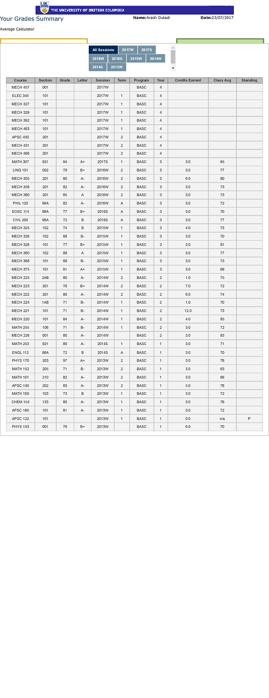

# ImprovedUBCTranscript
Bookmarklet that builds on top of [crclayton](https://github.com/crclayton) bookmarklet to improve the unofficial UBC Transcript.

It does this in four ways:
1. Adding a course names columns (Main thing missing from crclayton awesome bookmarklet)
2. Removing any courses without grades (Will upload a version that doesn't do this, just in case people want that)
3. Removing unnecessary widgets (calculator), columns (I didn't think the standing column added much information)
4. Spacing items out better and increasing the width of the table (It will appear as if some columns are cut-off but it looks fine in the print preview)
5. You can also manually edit the course names now to fix mistakes or shorten course names

## Instructions

1. There's a link on [**this page**](http://arashout.site/posts/improved-ubc-transcript) that you should drag onto your bookmarks bar

2. Go to your [**Grades Summary**](https://ssc.adm.ubc.ca/sscportal/servlets/SRVSSCFramework?function=SessGradeRpt) page.

3. Click the bookmark link to run!

## Output

The code gets rid of the extra tabs/average calculator app, spaces things out a little better, and aligns the table to the header. 

## Before Picture

This is what the transcript looked like before

### Known Issues:
Some older courses that no longer exist will have empty course name columns. 
